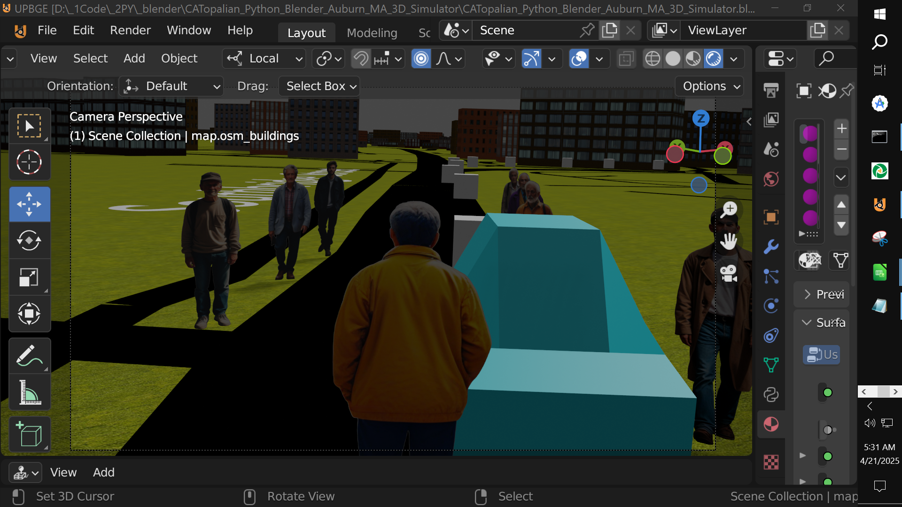

# CATopalian_Python_Blender_Auburn_MA_3D_Simulator
A Blender Game Engine 3D Simulation of the entire Town of Auburn, Massachusetts with Python as the programming language for interactions.  

## Requirments:
[Blender Game Engine](https://upbge.org/#/download)

We must download Blender Game Engine to use this application.  

Once downloaded, put mouse arrow in the 3D screen and press the letter P on the keyboard to begin the simulation.

---

### How to Download this App
1. Click the green Code Button on this github page
2. Choose Download ZIP
3. Save the Zip File
4. Extract All
5. Double click the HTML file to start the App

---

Happy Scripting :-)

